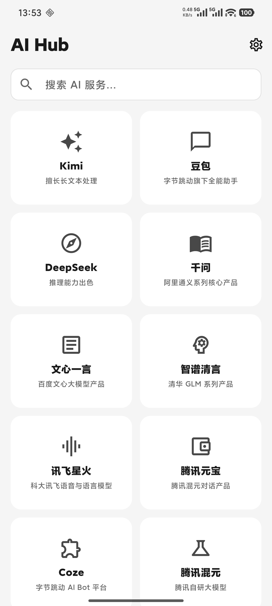
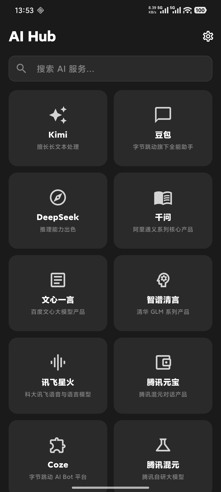
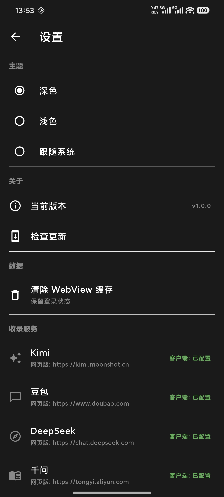

<div style="text-align: center;">

# AI Hub

**一站式 AI 服务聚合入口 —— 整合国内外主流 AI 对话平台，一键直达**

[](https://flutter.dev)
[](https://dart.dev)
[](./LICENSE)
[](https://developer.android.com)

</div>

---

## 项目介绍

AI Hub 是一款 Flutter 构建的 Android 应用，为用户提供**国内外主流 AI 服务的统一入口**。将 Kimi、豆包、DeepSeek、千问、文心一言、智谱清言等 12+ 个 AI 平台整合在卡片式主页中，支持按使用频率自动排序、一键搜索定位，并能智能判断是否优先启动本地 App（已安装时直接唤起原生应用，未安装时跳转网页版）。

## 功能展示

- **AI 服务聚合** — 内置 12+ 个主流 AI 对话平台卡片，覆盖文本处理、推理、多模态等场景
- **智能启动** — 优先检测并启动本地 App（如已安装豆包、DeepSeek），否则跳转网页版
- **使用频率排序** — 自动统计各服务点击次数，常用服务置顶
- **实时搜索** — 支持按名称、描述模糊搜索，快速定位目标服务
- **暗黑模式** — 完整支持亮色/暗色主题切换，跟随系统或手动设置
- **OTA 自动更新** — 首次启动自动检测 GitHub Release，有新版本弹窗提示
- **流畅动画** — 卡片入场渐显 + 位移过渡效果，体验流畅

## 技术栈

| 层级 | 技术 | 版本 |
|------|------|------|
| 框架 | Flutter | 3.12+ |
| 语言 | Dart | 3.12+ |
| 原生 | Kotlin (Android) | — |
| 状态管理 | Provider | 6.1.5+ |
| 本地存储 | SharedPreferences | 2.5.5+ |
| 网络请求 | http | 1.6.0+ |
| 路径获取 | path_provider | 2.1.5+ |
| 外部链接 | url_launcher | 6.3.2+ |
| UI 规范 | Material 3 | — |

## 快速开始

### 环境要求

- Flutter SDK 3.12+（`flutter --version` 确认）
- Dart SDK 3.12+
- Android Studio / VS Code + Flutter 插件
- Android 设备或模拟器（API 21+）

### 安装运行

```bash
# 1. 克隆项目
git clone https://github.com/XU-QiYi/ai-hub.git
cd ai-hub

# 2. 获取依赖
flutter pub get

# 3. 运行（连接设备或启动模拟器后）
flutter run
```

### 构建 APK

```bash
flutter build apk --release
```

产出路径：`build/app/outputs/flutter-apk/app-release.apk`

## 项目结构

```
ai_hub/
├── lib/
│   ├── main.dart                # 入口文件
│   ├── app.dart                 # MaterialApp 配置、主题、路由
│   ├── config/
│   │   ├── services_config.dart # AI 服务列表配置
│   │   └── theme_config.dart    # 主题颜色配置
│   ├── models/
│   │   └── ai_service.dart      # AiService 数据模型
│   ├── pages/
│   │   ├── home_page.dart       # 主页（服务网格 + 搜索）
│   │   └── settings_page.dart   # 设置页（主题切换 + 检查更新）
│   ├── providers/
│   │   └── theme_provider.dart  # 主题状态管理
│   ├── services/
│   │   ├── storage_service.dart # SharedPreferences 存储
│   │   └── update_service.dart  # GitHub Release OTA 更新
│   ├── utils/
│   │   └── week_utils.dart      # 周日期工具
│   └── widgets/
│       └── service_card.dart    # 服务卡片组件
├── android/                     # Android 原生代码
├── pubspec.yaml                 # 依赖配置
└── README.md
```

## 截图展示


> 将截图放入 `screenshots/` 目录后可展示

<div style="text-align: center;">
<table>
  <tr>
    <td>
      
    </td>
  </tr>
  <tr>
    <td>
      
    </td>
  </tr>
</table>
</div>

## 开发说明

### 添加新的 AI 服务

在 `lib/config/services_config.dart` 的 `aiServices` 列表中添加：

```dart
AiService(
  name: '服务名称',
  url: 'https://example.com',
  description: '一句话描述',
  icon: Icons.icon_name,          // Material 图标
  packageName: 'com.example.app', // 本地包名，无则填 null
),
```

### 本地调试

```bash
# 代码格式化
dart format lib/

# 静态分析
flutter analyze

# 运行测试
flutter test
```

### 规范

- 文件名 `snake_case.dart`，类名 `PascalCase`，变量 `camelCase`
- 一个文件一个 class，不超过 300 行
- 导入顺序：Dart 核心 → Flutter → 第三方 → 项目文件
- MethodChannel 命名格式：`com.aihub.{功能}`


